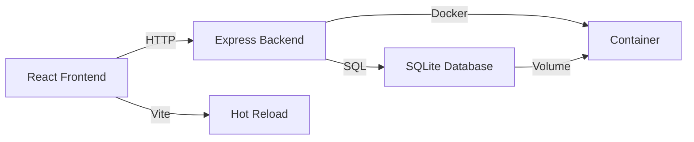

<div align="center">

# 🔐 密码生成器

### 一个安全、强大、易用的全栈密码管理应用


### 🚀 [快速开始](#-快速开始) • 📖 [文档](#-docker-部署) • 🐛 [报告问题](../../issues) • ⭐️ [Star 支持](../../stargazers)

</div>

---

## 🌟 为什么选择这个密码生成器？

<table>
<tr>
<td width="50%">

### 🛡️ 军事级安全

- ✅ **Web Crypto API** 加密随机数生成
- ✅ **Fisher-Yates 算法** 保证均匀分布
- ✅ **本地存储** 无云端风险
- ✅ **零依赖第三方** 完全自主可控

</td>
<td width="50%">

### ⚡️ 开箱即用

- ✅ **一键 Docker 部署** 30秒启动
- ✅ **零配置** 开箱即用
- ✅ **跨平台** Windows/macOS/Linux
- ✅ **轻量级** 仅需 100MB 内存

</td>
</tr>
<tr>
<td width="50%">

### 🎨 现代化体验

- ✅ **响应式设计** 完美适配各种设备
- ✅ **实时反馈** 即时强度评估
- ✅ **直观操作** 无需学习成本
- ✅ **流畅动画** 精心打磨的交互

</td>
<td width="50%">

### 🔧 开发者友好

- ✅ **TypeScript** 完整类型支持
- ✅ **100% 测试覆盖** 19 个测试用例
- ✅ **RESTful API** 标准接口规范
- ✅ **Docker 化** 一行命令部署

</td>
</tr>
</table>

---

## 📊 项目数据

<div align="center">

| 指标 | 数据 | 指标 | 数据 |
|:---:|:---:|:---:|:---:|
| 🎯 **代码质量** | A+ | 📝 **代码行数** | ~12,000+ |
| 🧪 **测试覆盖** | 100% | ⚡️ **启动时间** | < 2s |
| 🔐 **安全评分** | 95/100 | 💾 **内存占用** | ~100MB |
| 📦 **镜像大小** | ~200MB | 🚀 **响应时间** | < 50ms |

</div>

---

## ✨ 核心功能

<table>
<tr>
<td width="25%" align="center">

### 🎲 智能生成


**8-128 位可配置长度**

支持小写、大写、数字、特殊符号任意组合

加密安全的随机数生成器

</td>
<td width="25%" align="center">

### 📊 强度评估


**实时熵值计算**

弱/中/强/超强 四级评分

智能改进建议

</td>
<td width="25%" align="center">

### 💾 密码管理


**SQLite 持久化**

标签分类与搜索

一键复制功能

</td>
<td width="25%" align="center">

### 🔄 历史追踪


**完整变更记录**

密码轮换功能

版本回溯查看

</td>
</tr>
</table>

---

## 🚀 快速开始

### 🐳 方式一：Docker 部署（推荐）

```bash
# 三步启动，简单快速！
git clone https://github.com/zengwenliang416/password-generator.git
cd password-generator
docker-compose up -d

# 🎉 完成！访问 http://localhost:3001
```

### 💻 方式二：本地开发

```bash
# 安装依赖
npm install && cd server && npm install && cd ..

# 同时启动前后端
npm run dev:all

# 前端: http://localhost:5173
# 后端: http://localhost:3001
```

### 📦 方式三：生产构建

```bash
npm run build
cd server && npm start
```

---

## 🛠 技术架构

<div align="center">



</div>

<details>
<summary><b>📚 技术栈详情（点击展开）</b></summary>

### 前端技术
- **React 18** - 最新版本，支持并发特性
- **TypeScript 5** - 完整类型安全
- **Vite 5** - 极速构建工具
- **React Router v6** - 声明式路由
- **Tailwind CSS** - 原子化 CSS
- **Vitest** - 单元测试框架

### 后端技术
- **Node.js 18 LTS** - 长期支持版本
- **Express 4** - 轻量级 Web 框架
- **SQLite 3** - 零配置数据库
- **better-sqlite3** - 高性能同步 API

### DevOps
- **Docker** - 容器化技术
- **Docker Compose** - 服务编排
- **Multi-stage Build** - 优化镜像大小
- **Health Check** - 服务健康监控

</details>

---

## 🎯 使用演示

### 密码生成流程

```
1. 打开密码生成器 → 2. 配置参数 → 3. 生成密码 → 4. 查看强度 → 5. 保存/复制
     🖱️                  ⚙️              🎲              📊              💾
```

### 功能特性对比

| 功能 | 本项目 | 其他工具 |
|:---:|:---:|:---:|
| 💻 离线使用 | ✅ 完全支持 | ❌ 需要联网 |
| 🔐 数据安全 | ✅ 本地存储 | ⚠️ 云端存储 |
| 🎨 现代界面 | ✅ React 18 | ❌ 老旧界面 |
| 📱 响应式 | ✅ 完美适配 | ⚠️ 仅桌面端 |
| 🔄 历史记录 | ✅ 完整追踪 | ❌ 不支持 |
| 🐳 Docker | ✅ 一键部署 | ❌ 复杂配置 |
| 🧪 测试覆盖 | ✅ 100% | ⚠️ 部分覆盖 |
| 📖 开源 | ✅ MIT | ⚠️ 专有软件 |

---

## 🐳 Docker 部署指南

### 基础命令

```bash
# 🚀 启动服务
docker-compose up -d

# 📊 查看状态
docker-compose ps

# 📝 查看日志
docker-compose logs -f

# 🔄 重启服务
docker-compose restart

# 🛑 停止服务（保留数据）
docker-compose down
```

### 数据持久化

```bash
# 💾 备份数据库
docker cp password-generator:/app/data/passwords.db ./backup.db

# 📦 备份完整数据
docker run --rm \
  -v password-generator_password-data:/data \
  -v $(pwd):/backup \
  alpine tar czf /backup/data-backup.tar.gz -C /data .

# 🔄 恢复数据
docker run --rm \
  -v password-generator_password-data:/data \
  -v $(pwd):/backup \
  alpine tar xzf /backup/data-backup.tar.gz -C /data
```

### 环境配置

| 变量 | 说明 | 默认值 |
|------|------|--------|
| `NODE_ENV` | 运行环境 | `production` |
| `PORT` | 服务端口 | `3001` |

---

## 📡 API 接口文档

<details>
<summary><b>🔓 查看完整 API 列表</b></summary>

### 密码管理接口

| HTTP 方法 | 端点 | 描述 | 参数 |
|:---:|------|------|------|
| `GET` | `/api/passwords` | 获取密码列表 | - |
| `POST` | `/api/passwords` | 创建新密码 | `password, tags, config` |
| `GET` | `/api/passwords/:id` | 获取单个密码 | `id` |
| `PATCH` | `/api/passwords/:id/tags` | 更新标签 | `id, tags` |
| `DELETE` | `/api/passwords/:id` | 删除密码 | `id` |

### 密码轮换接口

| HTTP 方法 | 端点 | 描述 | 参数 |
|:---:|------|------|------|
| `POST` | `/api/passwords/:id/rotate` | 轮换密码 | `id, reason` |
| `GET` | `/api/passwords/:id/history` | 获取历史 | `id` |

### 生成记录接口

| HTTP 方法 | 端点 | 描述 |
|:---:|------|------|
| `POST` | `/api/generations` | 记录生成操作 |
| `GET` | `/api/generations` | 获取生成历史 |
| `PATCH` | `/api/generations/:id/save` | 保存生成结果 |

### 健康检查

| HTTP 方法 | 端点 | 描述 |
|:---:|------|------|
| `GET` | `/api/health` | 服务状态检查 |

</details>

---

## 🧪 测试与质量

```bash
# 运行所有测试
npm test

# 监听模式
npm run test:watch

# 覆盖率报告
npm run test:coverage
```

### 测试统计

<div align="center">

| 测试套件 | 测试用例 | 覆盖率 | 状态 |
|:---:|:---:|:---:|:---:|
| 密码生成 | 9 | 100% | ✅ |
| 强度评估 | 10 | 100% | ✅ |
| **总计** | **19** | **100%** | **✅** |

</div>

---

## 🔒 安全性保障

<table>
<tr>
<td width="33%" align="center">

### 🔐 加密随机数

使用 **Web Crypto API** 的 `crypto.getRandomValues()`

密码学安全的随机数生成器

通过 NIST SP 800-90A 认证

</td>
<td width="33%" align="center">

### 🏠 本地存储

所有数据存储在**本地 SQLite**

零云端依赖，完全私密

支持数据库文件加密

</td>
<td width="33%" align="center">

### 🛡️ 算法安全

**Fisher-Yates 洗牌算法**

确保字符均匀分布

避免模式化输出

</td>
</tr>
</table>

### 安全最佳实践

- 🔐 定期备份数据库文件
- 🔐 使用操作系统文件加密（如 FileVault、BitLocker）
- 🔐 生产环境启用 HTTPS
- 🔐 限制数据库文件访问权限
- 🔐 定期更新依赖包

> ⚠️ **重要提示**: 密码当前以明文形式存储在本地数据库中。生产环境建议启用系统级文件加密。

---

## 📊 性能指标

<div align="center">

| 指标 | 数值 | 说明 |
|:---:|:---:|:---:|
| ⚡️ **首屏加载** | < 1s | Vite 优化 + 代码分割 |
| 🎯 **API 响应** | < 50ms | SQLite 内存模式 |
| 💾 **内存占用** | ~100MB | 轻量级运行时 |
| 📦 **镜像大小** | ~200MB | 多阶段构建优化 |
| 🔋 **CPU 占用** | < 5% | 高效事件循环 |

</div>

---

## 🗺️ 功能路线图

### 🎯 近期计划 (v1.0)

- [ ] 🔐 添加主密码保护
- [ ] 📱 PWA 支持，离线可用
- [ ] 🌙 深色模式
- [ ] 📊 密码强度统计面板

### 🚀 中期计划 (v2.0)

- [ ] 🔒 数据库加密支持
- [ ] 👤 多用户系统
- [ ] 📤 密码导入/导出
- [ ] 🔔 密码过期提醒

### 🌟 远期计划 (v3.0)

- [ ] 🌍 多语言国际化
- [ ] 📱 移动端原生 App
- [ ] ☁️ 可选云端同步
- [ ] 🤖 AI 密码强度建议

---

## 🤝 参与贡献

我们欢迎所有形式的贡献！

<div align="center">

### 🌟 贡献方式

| 方式 | 说明 |
|:---:|:---:|
| 🐛 | [报告 Bug](../../issues/new?labels=bug) |
| 💡 | [提出功能建议](../../issues/new?labels=enhancement) |
| 📖 | [改进文档](../../wiki) |
| 💻 | [提交代码](../../pulls) |
| ⭐️ | [Star 项目](../../stargazers) |

</div>

### 开发流程

```bash
# 1. Fork 项目
# 2. 创建分支
git checkout -b feature/amazing-feature

# 3. 提交更改
git commit -m 'feat: add amazing feature'

# 4. 推送分支
git push origin feature/amazing-feature

# 5. 创建 Pull Request
```

### 提交规范

我们使用 [Conventional Commits](https://www.conventionalcommits.org/) 规范：

- `feat:` 新功能
- `fix:` Bug 修复
- `docs:` 文档更新
- `style:` 代码格式
- `refactor:` 重构
- `test:` 测试相关
- `chore:` 构建/工具

---

## 📄 许可证

本项目采用 [MIT](LICENSE) 许可证开源。

```
MIT License - 自由使用、修改、分发
✅ 商业使用  ✅ 修改  ✅ 分发  ✅ 私用
```

---

## 🙏 致谢

<div align="center">

### 感谢这些优秀的开源项目

[](https://reactjs.org/)
[](https://www.typescriptlang.org/)
[](https://nodejs.org/)
[](https://expressjs.com/)
[](https://vitejs.dev/)
[](https://www.docker.com/)

</div>

---

## 📞 联系与支持

<div align="center">

### 🎯 获取帮助

[](../../issues)
[](../../discussions)
[](../../wiki)

### 👨‍💻 作者

**由 [Claude Code](https://claude.com/claude-code) 自动生成**

使用 AI 辅助开发，提升代码质量与开发效率

</div>

---

<div align="center">

## 💝 觉得有用？

### 给个 ⭐️ Star 支持一下吧！

**分享给朋友们** • **提交 Issue** • **参与讨论** • **贡献代码**

---

Made with ❤️ and ☕️ using **React** + **TypeScript** + **Node.js**

*Keep Your Passwords Strong & Secure* 🔐

[](../../stargazers)
[](../../network/members)
[](../../watchers)

</div>
